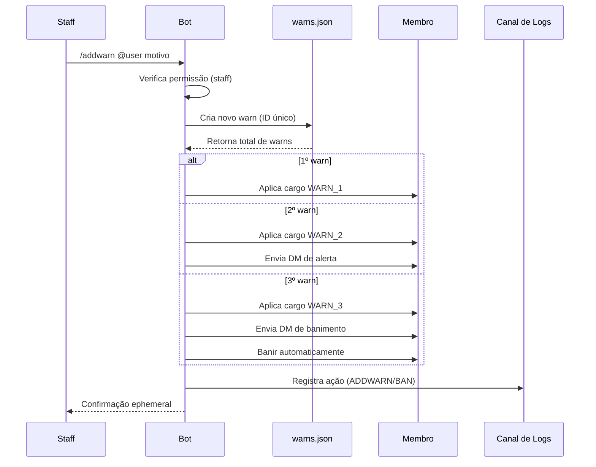

<p align="center">
  
</p>

<p align="center">
  
  
  
  
  
</p>

<br>

<h1 align="center"> 𝙷𝚘𝚜𝚝𝚅𝚒𝚕𝚕𝚎 𝚆𝚊𝚛𝚗 • 𝙱𝙾𝚃</h1>

<p align="center">
  Sistema de advertências com 3 níveis, cargos automáticos, DM de alerta e banimento automático.
</p>

<p align="center">
  <b>𝙼𝚊𝚍𝚎 𝙱𝚢 𝚈𝟸𝚔_𝙽𝚊𝚝</b>
</p>

---

## ✦ 𝙰𝙱𝙾𝚄𝚃

> O **HostVille Warn • BOT** é um sistema de moderação focado em advertências progressivas, desenvolvido em **Node.js + discord.js v14**. Ele permite que a staff aplique warns, gerencie cargos automaticamente e tome ações disciplinares como banimento após o terceiro aviso.

---

## ✦ 𝙵𝙴𝙰𝚃𝚄𝚁𝙴𝚂

```txt
⚠️ WARN LEVELS      → 3 níveis progressivos
🎭 AUTO ROLES       → Cargos WARN 1/2/3 aplicados automaticamente
💬 DM NOTIFICATIONS → Mensagem privada no 2º e 3º warn
🚫 AUTO BAN         → Banimento automático ao atingir 3 warns
🛡 STAFF ONLY        → Comandos restritos a cargos configurados
📋 LOGS             → Registro completo em canal de logs
📦 PERSISTÊNCIA     → Banco de dados JSON (warns.json)
🧠 CACHE            → Cache de membros para performance
```

---

✦ 𝚂𝚈𝚂𝚃𝙴𝙼 𝙵𝙻𝙾𝚆



---

✦ 𝘾𝙊𝙈𝙈𝘼𝙉𝘿𝙎

/addwarn

⚠️ Adiciona uma advertência
• Escolha o usuário
• Motivo obrigatório
• Aplica cargo e pode acionar DM/ban

/removewarn

🔄 Remove a última advertência
• Reverte o cargo
• Atualiza o histórico

/warnstats

📊 Histórico de warns
• Lista todos os warns do usuário
• Mostra nível atual e status

---

✦ 𝙋𝙀𝙍𝙈𝙄𝙎𝙎𝙄𝙊𝙉𝙎

👮 STAFF
✔ Cargos configuráveis no código
✔ Acesso a todos os comandos

🚫 USUÁRIOS COMUNS
• Não podem usar comandos

---

✦ 𝘿𝘼𝙏𝘼𝘽𝘼𝙎𝙀

📁 warns.json
• Armazena todas as advertências
• IDs únicos, datas, motivos, staff responsável

✔ Leve
✔ Persistente
✔ Fácil manutenção

---

✦ 𝙊𝘽𝙅𝙀𝘾𝙏𝙄𝙑𝙀

✔ Aplicar moderação progressiva
✔ Automatizar punições
✔ Reduzir trabalho manual da staff
✔ Manter histórico confiável

---

📌 Status

🟢 Online • ⚡ Estável • 🔒 Seguro

---

<p align="center">
  <b>© 2026 HostVille Warn Bot • 𝙼𝚊𝚍𝚎 𝙱𝚢 𝚈𝟸𝚔_𝙽𝚊𝚝</b>
</p>